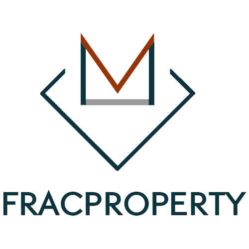

# Frac Property

We use a peer-to-peer network to run a decentralized platform that is both tamper-proof and easily verifiable.  The technology transition to fractionalizing real estate enables new capabilities while keeping ownership structures the same as traditional securities. With this unique selling point, we hope to create industry disruption by empowering individuals to invest in and create personalized portfolios of property investments; thereby completely changing how real estate transactions and ownership transfer are conducted.

Our technology not only gives investors full control and flexibility in managing their property portfolios but also unlocks potential liquidity and automatically enforces compliant transfers between buyers and sellers around the world.  Frictions and barriers to secondary market transfers are thus reduced. Private investments can become more liquid, making it possible to trade 24/7, worldwide, on licensed or peer-to-peer trading platforms, with near instantaneous settlement and no counterparty risk.

# Contract Addresses

| Contract  | Ethereum Address                                                                                                      |
| --------- | --------------------------------------------------------------------------------------------------------------------- |
| Frac      | [0x442Ea72e5303bFaB6b4c7BA84ff0D3E66Edc5Cd5](https://bscscan.com/address/0x442ea72e5303bfab6b4c7ba84ff0d3e66edc5cd5) |
| Blacklist | [0xAB7104a839C86e6Fd1Ea4E4a1238833A717848ea](https://bscscan.com/address/0xAB7104a839C86e6Fd1Ea4E4a1238833A717848ea) |
| Whitelist | [0x9fF7b773DF53355C1d959254895040a7048c8874](https://bscscan.com/address/0x9fF7b773DF53355C1d959254895040a7048c8874) |
| Junior(Test net)| [0x59dda7a2e40d95a4dd1da2403a5d45037f3abe5f](https://testnet.bscscan.com/address/0x59dda7a2e40d95a4dd1da2403a5d45037f3abe5f) |
| Senior(Test net)| [0x9b9ae9477db0b969b66ffeeb8006096a715cab6c](https://testnet.bscscan.com/address/0x9b9ae9477db0b969b66ffeeb8006096a715cab6c) |

# Links

| Name               | URL                                     |
| ------------------ | --------------------------------------- |
| FracProperty Website| https://fracproperty.com               |

# License

The FracProperty smart contract code in this repository is released under the [MIT License](./LICENSE).

## OpenZeppelin Licenses

This repository also contains contains Solidity smart contract code developed by
[OpenZeppelin](https://openzeppelin.com/). To ensure compliance with their copyright, copied and modified code has been
referenced below with links to OpenZeppelin's own open-source MIT licenses.

The [upgradeable proxy contracts](./contracts/upgradeability) are based on code released under this
[ZeppelinOS LICENSE](https://github.com/OpenZeppelin/openzeppelin-sdk/blob/v2.2.0/LICENSE).

The [access role contracts](./contracts/access), [lifecycle contracts](./contracts/lifecycle),
[SafeMath.sol contract](./contracts/math/SafeMath.sol), base [ERC20 contracts](./contracts/token) and
[Address.sol contract](./contracts/utils/Address.sol) are  based on code released under this
[OpenZeppelin Contracts LICENSE](https://github.com/OpenZeppelin/openzeppelin-contracts/blob/v2.2.0/LICENSE).
